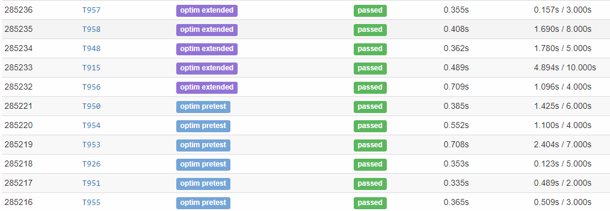
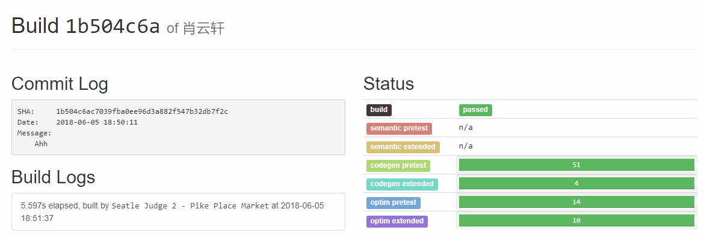

# MX-Compiler
Write a compiler from scratch. 

This is a course project for [Compiler 2018](https://acm.sjtu.edu.cn/wiki/Compiler_2018) ACM Class. In this project, the XYXCompiler transforms [Mx Language](https://acm.sjtu.edu.cn/w/images/3/30/M_language_manual.pdf)(a C-like language) into x86-64 assembly language. 

This Compiler passed 400+ testcase on an online evaluation platform. The performance of XYXCompiler on Ubuntu 16.04  is comparable with gcc-O1.  

## Architecture

**Front End**  
M× language -----> Antlr Parse Tree -----> AST(Abstract Syntax Tree)

**Semantic Checker**  
AST -----> ScopeTree Builder -----> Type Checker -----> Reference Checker

**Intermediate Representation**  
AST -----> IR(Control Flow Graph) ------>Dead Block Elimination

**Back End**  
CFG -----> Liveliness Analyse ------> Graph Coloring Optimization -----> Allocate Stack Frame -----> Code Generator

## Tools
```
LLIRInterpreter.java (By Lequn Chen)
antlr-4.7.1-complete.jar
```

### LLIRInterpreter
Print your IR in LLIR format, and the interpreter will run your IR and return a number.  
Original Repo： https://github.com/abcdabcd987/LLIRInterpreter

### ANTLR
ANTLR[(homepage)](https://www.antlr.org/) is a powerful parser generator for reading, processing, executing, or translating structured text or binary files. From a grammar, ANTLR generates a parser that can build and walk parse trees.

## Run the XYXCompiler
```
java XYXCompiler.Main
```
Input a sequence of Mx-language code from system control plane, the optimized x86-64 assembly will be printed put.

For more information please come and see our [homepage](https://acm.sjtu.edu.cn/wiki/Compiler_2018).


## Demo
Test cases



Final Commit




Example of Source Language Code
```C
void cost_a_lot_of_time()
{
	int a = 3100;
	int b = 0;
	int c = 1;
	for (b = 0; b < 100000000; ++b)
		c = c * 2 - c;
	println(toString(a));
}

void foo(int d, int x, int y) {
    println(toString(d * 1000 + x * 10 + y));
    if (d == 1) return;
    int t = x; x = y; y = t;
    foo(1, x, y);
    println(toString(d * 1000 + x * 10 + y));
}

int main() {
	int a = 3100;
	int b = 0;
	int c = 1;
	for (b = 0; b < 100000000; ++b)
		c = c * 2 - c;
        println(toString(a));

	cost_a_lot_of_time();

	foo(7, 5, 3);

	int[] aa;
        int[] bb = new int[10];
        int[][] cc = new int [2][];

	return 0;
}
```

